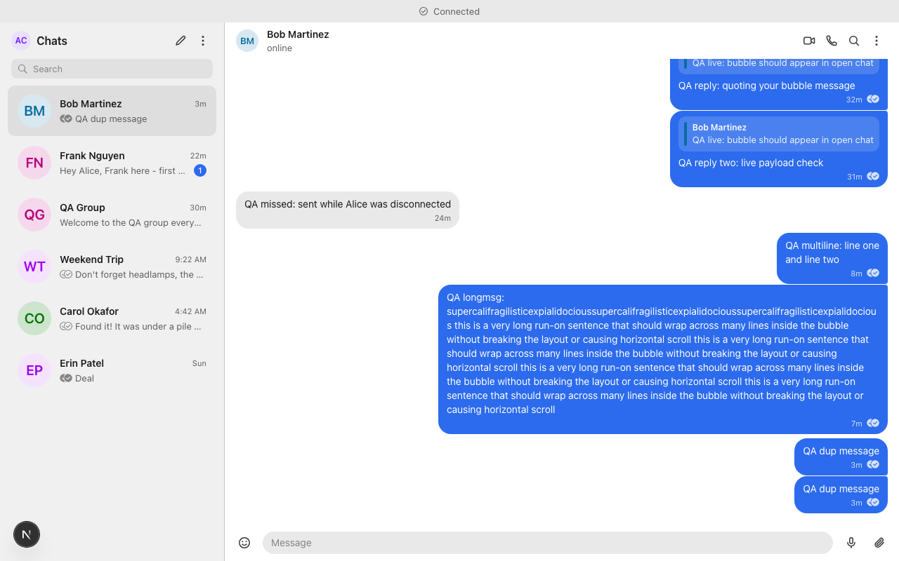
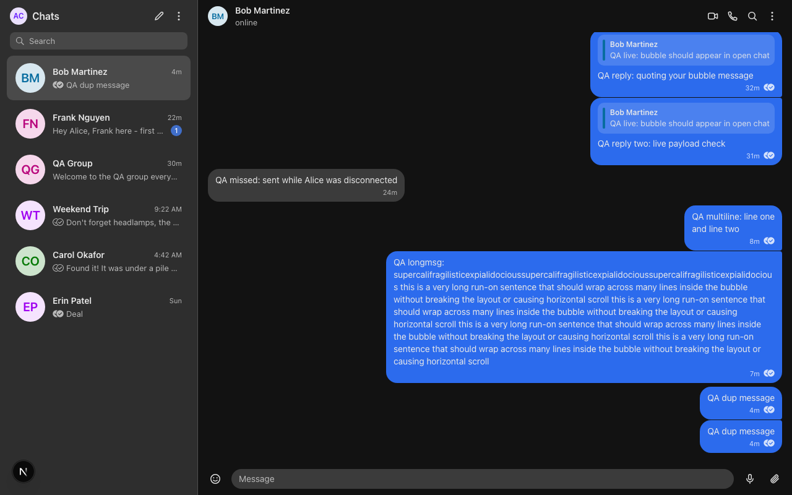
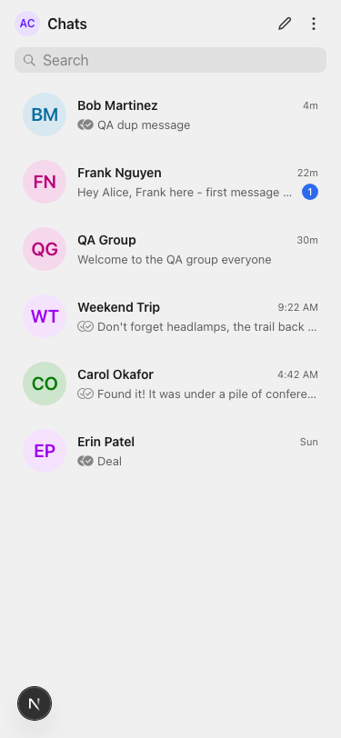
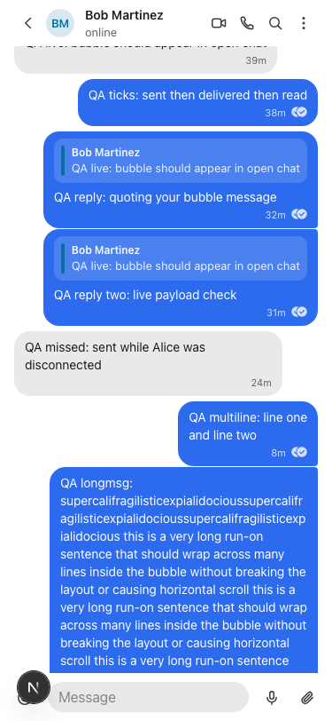
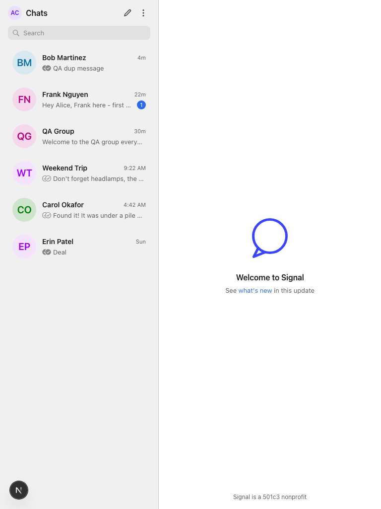
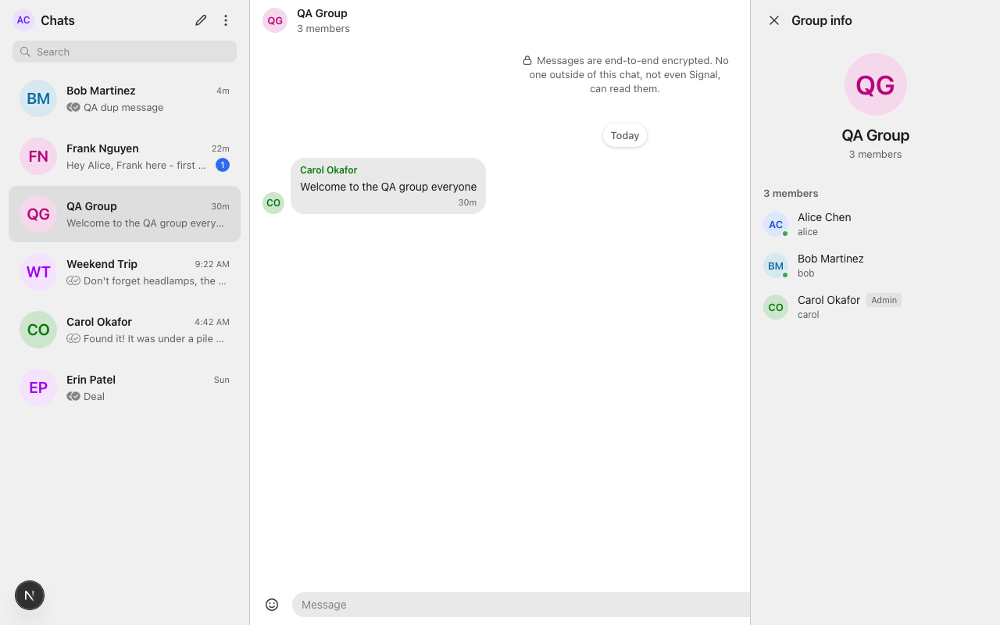
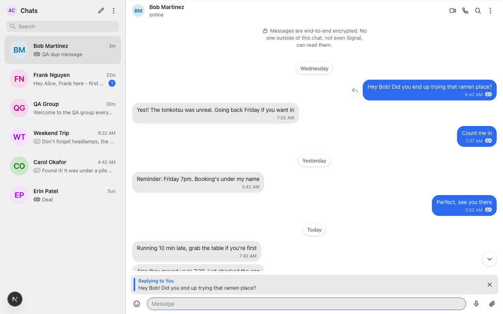

# Signal Clone

A real-time chat application in the spirit of Signal: 1:1 and group messaging, delivery/read receipts (Signal's circled-check ticks through sending → sent → delivered → read), typing indicators, online presence, unread counts, reply quotes, light/dark theming, and a phone/tablet/desktop responsive layout — built on Next.js, FastAPI, SQLite, and plain WebSockets.

My guiding principle was boring, explainable architecture: no real-time libraries, no Redis, no ORM magic. Every pattern here is either straight from an official doc (FastAPI's WebSockets tutorial, react.dev's chat-connection effect example) or an obvious adaptation of one, and every deliberate simplification is written down below with a one-sentence "here's how I'd do it at scale" answer.

## Live demo

- Frontend: `https://signal-clone-scaler.vercel.app`
- Backend API + docs: `https://signal-clone-scaler.onrender.com` (interactive API docs at `/docs`)
- Uptime status page: https://stats.uptimerobot.com/JKUm71scOz (independent 5-minute health monitoring)

Use the one-click **Login as Alice** / **Login as Bob** buttons on the login page — open both in separate browser windows to see real-time delivery, ticks, and typing indicators between them. Note: the backend runs on Render's free tier; if it has gone cold, first load can take ~30–60 s while the instance wakes (the client's reconnect loop rides this out automatically).

## Bonus features — what shipped and what didn't

Plain ledger, no hedging:

- **Dark mode — shipped.** Light / Dark / System in Settings → Appearance, written as `data-theme` on `<html>`, persisted to localStorage, applied by an inline script before hydration (no flash); System follows `prefers-color-scheme` live.
- **Reply quotes — shipped.** Hover/tap Reply on any bubble → preview bar above the composer (Esc cancels) → the send carries `reply_to_id`; the server validates the quoted message belongs to the same conversation and every serialized message carries a compact `reply_to` summary so quotes render even when the original is on an unloaded history page.
- **Reactions — not built.**
- **Attachments — not built** (the composer's attach/emoji/mic buttons show a "Coming Soon" toast).
- **Disappearing messages — not built** ("Coming Soon" placeholder in settings).

## Screenshots


*Desktop, light theme: two-pane shell, circled-check ticks, and reply quote blocks.*


*Desktop, dark theme: the same conversation on the dark token set.*


*Mobile: single-pane conversation list with unread badges and previews.*


*Mobile: full-screen chat pane with back navigation.*


*Tablet: the responsive middle ground per DESIGN_BRIEF.md.*


*Group info panel: members, roles, and admin add/remove.*


*Composing a reply: the preview bar above the composer (Esc to cancel).*

## Tech stack

| Layer | Choice | Notes |
|---|---|---|
| Frontend | Next.js (TypeScript, App Router) | `'use client'` components where interactivity lives; deployed on Vercel |
| Backend | FastAPI (Python) on uvicorn | One async worker; REST + WebSocket on the same app object |
| Database | SQLite | WAL mode, `foreign_keys=ON`; accessed via sync SQLAlchemy 2.0 (declarative models, explicit `select()`, hardest queries as hand-written parameterized `text()` SQL) |
| Real-time | Plain WebSockets | Raw `new WebSocket()` client, no Socket.IO — a Socket.IO client can't even connect to a plain WS endpoint |
| Hosting | Vercel (frontend) + Render free web service (backend, built from `backend/Dockerfile`) | $0 total, no credit card |

## Repository layout

```
backend/
  Dockerfile           # python:3.12-slim; CMD runs uvicorn --workers 1 on $PORT (exec'd so SIGTERM lands)
  render.yaml          # Render service config: docker runtime, free plan, rootDir backend,
                       #   FRONTEND_ORIGIN env var (the CORS allow-list origin). Note: Render
                       #   Blueprints read render.yaml from the repo ROOT — copy it there if
                       #   deploying via Blueprint; dashboard click-ops needs no file at all
  app/
    main.py            # app wiring: CORS, routers, /health, lifespan (create_all + seed-if-empty)
    db.py              # engine, PRAGMA listener (foreign_keys/WAL/busy_timeout), sessionmaker, get_db
    models.py          # SQLAlchemy 2.0 declarative models (the DDL below, as code)
    queries.py         # named query functions; unread counts + receipt aggregates as hand-written SQL
    ws.py              # the realtime layer: ConnectionManager + /ws endpoint + event dispatch
    schemas.py         # Pydantic request/response models
    deps.py            # get_current_user (token -> sessions lookup)
    routers/           # auth, contacts, conversations, groups
    seed.py            # idempotent demo seed (runs on every cold start)
  tests_ws_integration.py  # M1+M2 protocol integration suite (see Tests below)
  tests_ws_m2.py           # receipts/typing/unread suite
  tests_ws_m3.py           # groups + membership push suite
frontend/
  app/                 # App Router: login page, (chat) layout + two-pane shell, tokens.css (theme variables)
  lib/                 # types.ts (WS events as a TS discriminated union), api.ts (fetch wrapper),
                       #   receipts.ts (MIN-pointer tick derivation), conversation.ts, formatTimestamp.ts
  state/               # ChatProvider.tsx (socket, reconnect, heartbeat) + chatReducer.ts
  components/          # ConversationList, ChatPane, MessageBubble, StatusTicks, Composer, modals, Avatar, banner
docs/
  screenshots/         # the images embedded above
```

## Setup (local development)

Prerequisites: Python 3.12+, Node 20.9+ (required by Next.js 16).

**Backend** (serves on `http://localhost:8000`):

```bash
cd backend
python -m venv .venv
source .venv/bin/activate        # Windows: .venv\Scripts\activate
pip install -r requirements.txt
uvicorn app.main:app --reload --port 8000
```

On startup the app creates the SQLite schema (`Base.metadata.create_all`) and runs an idempotent seed if the database is empty: six demo users (Alice, Bob, and friends), a few DMs, a "Weekend Trip" group, staggered message history, and varied receipt states — so the app boots straight into a demo-ready state.

**Frontend** (serves on `http://localhost:3000`):

```bash
cd frontend
npm install
npm run dev
```

No env file is required for local dev: the client defaults to `http://localhost:8000` and derives the WS URL from the API URL (`http → ws`), so the two can never point at different hosts. To point elsewhere, create `frontend/.env.local`:

```
NEXT_PUBLIC_API_URL=http://localhost:8000
# optional — derived from NEXT_PUBLIC_API_URL when unset
NEXT_PUBLIC_WS_URL=ws://localhost:8000
```

**Logging in:** authentication is mocked with a fixed OTP. Log in with any seeded phone number (or register a fresh, unused one) and enter **`123456`** as the code — or skip typing entirely with the one-click **Login as Alice** / **Login as Bob** buttons. Open two browsers (or one normal + one incognito window), log in as Alice in one and Bob in the other, and chat.

A note on dev mode: `--reload` restarts the backend on every file save, which drops live sockets (abnormal close 1006). That's expected; the client's exponential-backoff reconnect picks them back up.

## Tests

Three integration suites in `backend/` exercise the real WS protocol end-to-end against a live backend. Each suite runs against its **own fresh throwaway database** — never the dev `signal.db`, and never a database another suite already mutated, because the checks assume exactly the seed state. The pattern per suite (full instructions in each file's docstring):

```bash
cd backend
rm -f /tmp/ws_m2.db*
DATABASE_URL=sqlite:////tmp/ws_m2.db .venv/bin/uvicorn app.main:app --port 8000 &
.venv/bin/python tests_ws_m2.py
# then kill the server, and repeat with a fresh DB file for the other suites
```

- `tests_ws_integration.py` — M1+M2 protocol: ack/new/delivered, persist-first, offline catch-up, idempotent retry, bad-token 1008, ping/pong, error frames
- `tests_ws_m2.py` — receipts: live + on-connect delivered, read broadcast, monotonic pointers, typing relay (nothing persisted), non-member rejection
- `tests_ws_m3.py` — groups: `conversation.created` push, group fan-out, MIN read semantics, admin add/remove (403 for non-admins), rename push

The only test dependency is the `websockets` pip package (test-only; deliberately not in `requirements.txt`) plus stdlib `urllib` for REST.

## Architecture overview

Two free platforms, two origins. Vercel serves the Next.js frontend; Render runs the FastAPI backend from `backend/Dockerfile`. Vercel can't host — or even proxy — the WebSocket (its Python runtime is serverless functions, which can't hold a persistent connection), so the browser connects **directly** to Render over `wss://`. The backend URLs reach the client as `NEXT_PUBLIC_API_URL` / `NEXT_PUBLIC_WS_URL`, inlined into the JS bundle at build time. The cross-origin split means CORS applies to the REST calls — and only those; browsers don't enforce CORS on WebSocket handshakes at all.

```
┌─────────────────────────┐
│  Vercel — Next.js       │   serves the page + JS bundle
└──────────┬──────────────┘
           │ page load
           ▼
   Browser (Alice / Bob)
           │
           │  https://signal-clone-scaler.onrender.com/api/*     (REST — CORS applies)
           │  wss://signal-clone-scaler.onrender.com/ws?token=…  (live events — CORS does not)
           ▼
┌─────────────────────────────────────────────────────┐
│  Render free web service — TLS terminated at edge,  │
│  one public port carries REST and the WS Upgrade    │
│  ┌───────────────────────────────────────────────┐  │
│  │  FastAPI — ONE uvicorn worker                 │  │
│  │  ConnectionManager: dict[user_id, WebSocket]  │  │
│  │  SQLite (WAL) — source of truth, on an        │  │
│  │  ephemeral disk: create_all + seed-if-empty   │  │
│  │  on every cold start                          │  │
│  └───────────────────────────────────────────────┘  │
└─────────────────────────────────────────────────────┘
```

**The ConnectionManager.** A module-level singleton holding `dict[user_id, WebSocket]` — the registry of who's online. The `/ws` endpoint is a long-running coroutine: it validates the session token from the query string *before* accepting (the browser's `WebSocket` constructor can't set an `Authorization` header), registers the socket, then loops on `await receive_json()` until the client disconnects (which arrives as a `WebSocketDisconnect` exception, whose handler evicts the dict entry). Because REST routes and the WS route live on the same app object in the same process, REST handlers import this same manager to push live events — e.g. an admin removing a group member over REST pushes `member.removed` to the removed user's live socket. Same process, same memory, same dict.

**Why exactly one uvicorn worker.** My connection registry is a process-local dict; with 4 workers, user A's socket could land on worker 1 and user B's on worker 3, and worker 1's dict has no idea B exists — delivery breaks silently. One async worker holds thousands of idle sockets, since each connection is just a coroutine parked at `await receive_json()`, costing nearly nothing while idle — orders of magnitude beyond a demo's needs. To scale horizontally I'd keep the same per-process manager and add Redis pub/sub: each worker subscribes, publishes inbound messages, and relays to its own local sockets — exactly what FastAPI's docs recommend. (Render's free tier runs exactly one instance anyway; the platform and the architecture agree.)

**Persist first, then fan out.** SQLite is the sole source of truth; the WebSocket is only a live-push optimization on top of it. Every message is INSERTed before any socket I/O. If the recipient is offline, nothing more happens — the message is already in the database, and "offline delivery" is just a REST GET on their next load. No queues, no replay buffers, no sequence numbers.

**REST vs WS split rule.** *If the client asks, it's REST; if the server tells you something you didn't just ask for, it's WS.* Everything request/response-shaped (login, contacts, conversation list, paginated history, group CRUD) is REST and gets HTTP semantics for free — status codes, curl-testability, the auto-generated `/docs` page. The WebSocket carries only live events. One deliberate exception: message **send** goes over WS rather than REST POST, so the ack round-trip that drives `sending → sent` shares one channel with the push.

**Message status state machine.** Strictly monotonic — `sending → sent → delivered → read` — and each state has exactly one writer:

| Transition | Actor | Mechanism |
|---|---|---|
| → `sending` | Sender's client | Optimistic bubble keyed by a `crypto.randomUUID()` client_id; never exists server-side |
| `sending → sent` | Server, at INSERT commit | `message.ack` carries the real id + server timestamp; the client reconciles the bubble in place by client_id |
| `sent → delivered` | Server, at push time | Successful push to a live socket, or a bulk pointer advance when the recipient's socket next connects |
| `delivered → read` | Recipient's client | Sends `read` when the chat is open/visible; server advances the read pointer and broadcasts |
| `sending → failed` | Sender's client only | No ack before socket close → "tap to retry"; retry reuses the same client_id, and `UNIQUE(sender_id, client_id)` makes it idempotent |

Ticks: spinner = sending · one circled check = sent · two circled checks = delivered by **all** other members · two **filled** circled checks = read by **all** (`MIN()`-across-members semantics). Glyphs follow Signal's v3 status icons: checks inside circles, and read state is filled — never blue.

## Database schema

Six tables. Conversations are unified: a DM is just a 2-member conversation with no name — so messages FK one table regardless of type, the conversation list is one query, and every fan-out path is identical for 1:1 and groups.

```sql
users (
  id            INTEGER PRIMARY KEY,
  phone         TEXT UNIQUE NOT NULL,
  username      TEXT UNIQUE NOT NULL,
  display_name  TEXT NOT NULL,
  last_seen_at  TEXT,                -- written on WS disconnect
  created_at    TEXT NOT NULL
)
-- Why: identity. Avatars are derived (initials + color hash), so no upload column.

sessions (
  token       TEXT PRIMARY KEY,      -- random token; doubles as the ?token= WS credential
  user_id     INTEGER NOT NULL REFERENCES users(id),
  created_at  TEXT NOT NULL
)
-- Why: mocked auth still needs real sessions; one lookup authenticates both REST and WS.

contacts (
  owner_id         INTEGER NOT NULL REFERENCES users(id),
  contact_user_id  INTEGER NOT NULL REFERENCES users(id),
  created_at       TEXT NOT NULL,
  PRIMARY KEY (owner_id, contact_user_id)
)
-- Why: a directed edge, like a phone address book — me adding you doesn't add me to yours.

conversations (
  id          INTEGER PRIMARY KEY,
  type        TEXT NOT NULL CHECK (type IN ('direct','group')),
  name        TEXT,                  -- groups only; NULL for DMs
  dm_key      TEXT UNIQUE,           -- 'minUserId:maxUserId' for DMs; prevents duplicate DM pairs
  created_by  INTEGER REFERENCES users(id),
  created_at  TEXT NOT NULL
)
-- Why unified: one FK target for messages, one left-pane query, one fan-out path.

conversation_members (
  conversation_id            INTEGER NOT NULL REFERENCES conversations(id),
  user_id                    INTEGER NOT NULL REFERENCES users(id),
  role                       TEXT NOT NULL DEFAULT 'member' CHECK (role IN ('admin','member')),
  last_delivered_message_id  INTEGER NOT NULL DEFAULT 0,   -- receipt pointer #1
  last_read_message_id       INTEGER NOT NULL DEFAULT 0,   -- receipt pointer #2
  joined_at                  TEXT NOT NULL,
  PRIMARY KEY (conversation_id, user_id)
)
-- Why: membership + role for group admin, AND the entire receipts system in two integers.

messages (
  id               INTEGER PRIMARY KEY AUTOINCREMENT,     -- monotonic id = ordering + pagination cursor
  conversation_id  INTEGER NOT NULL REFERENCES conversations(id),
  sender_id        INTEGER NOT NULL REFERENCES users(id),
  body             TEXT NOT NULL,
  reply_to_id      INTEGER REFERENCES messages(id),       -- nullable; powers the reply-quotes bonus (implemented)
  client_id        TEXT NOT NULL,
  created_at       TEXT NOT NULL,
  UNIQUE (sender_id, client_id)                           -- makes retry-after-reconnect idempotent
)
-- Why: the source of truth. Server timestamp + AUTOINCREMENT id define ordering — never the client clock.

-- Index: messages(conversation_id, id). PRAGMAs on every connection:
-- foreign_keys=ON (SQLite does not enforce FKs by default), journal_mode=WAL, busy_timeout=5000.
```

**The dual-pointer receipts design.** There is no per-message receipts table. Each membership row carries two integer pointers — `last_delivered_message_id` and `last_read_message_id` — and those two integers power ticks, unread badges, and offline catch-up with one mechanism:

- Unread badge = `COUNT(messages.id > last_read_message_id)`.
- "Delivered to all" = `MIN(other members' delivered pointers) >= message.id`; same aggregate for read.
- Offline catch-up: when a socket connects, the server bulk-advances that user's delivered pointer and notifies online senders — receipt state is always *derivable from stored pointers*, so ticks are correct even if the live events were missed.

The trade-off is granularity: I can say "delivered to all five members" cheaply, but not render Signal-exact per-member tick detail per message. If I needed that, I'd add a per-message receipts table — I chose the pointer design because it answers every UI question this app actually asks with two integers per member instead of O(messages × members) rows.

## API overview

All REST routes are prefixed `/api` and take the session token as `Authorization: Bearer <token>` (REST can set headers; only the WS constructor can't). Interactive docs at `/docs` on the backend URL.

| Method + Path | Purpose |
|---|---|
| `POST /api/auth/register` | Create user (phone + username + display name) |
| `POST /api/auth/login` | Phone/username → "OTP sent" (mocked) |
| `POST /api/auth/verify-otp` | Fixed OTP `123456` → creates session, returns token |
| `POST /api/auth/logout` | Delete session row |
| `GET  /api/auth/me` | Current user from token |
| `GET  /api/users/search?q=` | Find users to add as contacts |
| `GET  /api/contacts` · `POST /api/contacts` | List / add contacts |
| `GET  /api/conversations` | The left-pane query: last-message preview, unread count, members, online flags |
| `POST /api/conversations` | Create DM (`peer_id`, deduped via `dm_key`) or group (`name` + `member_ids`, creator = admin); a newly created conversation pushes `conversation.created` to the other member(s) |
| `GET  /api/conversations/{id}/messages?before_id=&limit=50` | Paginated history on the AUTOINCREMENT id |
| `POST /api/conversations/{id}/members` | Admin adds member (also pushes `member.added` over WS) |
| `DELETE /api/conversations/{id}/members/{user_id}` | Admin removes member (pushes `member.removed`) |
| `PATCH /api/conversations/{id}` | Rename group (pushes `conversation.updated`) |
| `GET /health` | `{"ok": true}` — unprefixed; keep-warm pinger target |

The single WebSocket endpoint is `wss://<api>/ws?token=<session token>`. Every frame is JSON: `{"type": "...", ...payload}`, defined once as a TypeScript discriminated union and mirrored by the Python dispatch.

**Client → Server:**

| Type | Payload | Trigger / server action |
|---|---|---|
| `message.send` | `conversation_id, client_id, body, reply_to_id?` | Validate membership (and, for replies, that `reply_to_id` references a message in the SAME conversation — else an `invalid_reply_to` error frame) → INSERT → `message.ack` to sender → `message.new` to other online members → advance their delivered pointers → `receipt.delivered` back |
| `typing` | `conversation_id` | Keystroke, throttled to ~1 per 2–3 s; pure relay to online members, never touches the DB |
| `read` | `conversation_id, up_to_message_id` | Conversation open/visible; UPDATE read pointer → broadcast `receipt.read` |
| `ping` | — | Every ~25 s; heartbeat that defeats proxy idle timeouts and holds off free-tier spin-down |

**Server → Client:**

| Type | Payload | Sent to / client action |
|---|---|---|
| `message.ack` | `client_id, message` | Sender only; find bubble by client_id, update in place: `sending → sent` |
| `message.new` | `message` | Other online members; append bubble, bump preview + unread badge |
| `receipt.delivered` | `conversation_id, user_id, up_to_message_id` | Online senders; grey single → grey double when all members' pointers pass |
| `receipt.read` | `conversation_id, user_id, up_to_message_id` | Other online members; grey double → **filled** double when all read pointers pass (Signal's v3 icons: read is filled, never blue) |
| `typing` | `conversation_id, user_id` | Other online members; show "typing…", clear on 3 s timeout |
| `member.added` | `conversation_id, user` | All online members, including the new one (whose client adds the conversation); pushed by the REST handler through the same manager |
| `member.removed` | `conversation_id, user_id` | All online members, including the removed user (whose client drops the conversation) — their one final frame |
| `conversation.updated` | `conversation_id, name` | Online members; rename the group in place |
| `conversation.created` | `conversation` | On DM or group creation: the members other than the creator; their conversation lists gain the row live |
| `error` | `code, detail` | Offending client; logged/toasted on malformed frames |
| `pong` | — | Reply to the client's `ping` heartbeat |

The `message` object in `message.ack` / `message.new` — and every row of `GET /api/conversations/{id}/messages` — is one shape: `{id, conversation_id, sender_id, body, reply_to_id, reply_to, client_id, created_at}`. For replies (the reply-quotes bonus), `reply_to` is a compact server-derived summary of the quoted message, `{id, sender_id, sender_name, body_snippet}` (one extra query per send / history page), so the client can render the quote block even when the original message sits on an unloaded history page. For non-replies, `reply_to_id` and `reply_to` are `null`.

## Assumptions and deliberate simplifications

Each of these is a conscious trade against the ~24-hour budget, with the scale answer attached.

- **Fixed OTP (`123456`), no SMS.** The auth *flow* is real — register, OTP screen, session token issued and checked on every REST call and the WS handshake; only the SMS delivery is mocked. In production: an SMS provider plus rate limiting, and I'd mint a short-lived one-time ticket over REST for the WS handshake instead of reusing the session token in the query string.
- **Encryption is mocked** (the "end-to-end encrypted" lock banner). The honest story: with real E2EE, clients would encrypt before `ws.send` and the server would store and forward opaque ciphertext — my persist-then-fan-out path is unchanged either way, which is exactly why mocking it is honest rather than hand-waving.
- **One socket per user; no multi-tab support.** A new login replaces the old socket. Multi-device would make the manager `dict[user_id, set[WebSocket]]` and fan out to all of a user's sockets.
- **Ephemeral free-tier disk — data resets on every redeploy, restart, or spin-down. By design.** Render's free filesystem doesn't persist (SQLite explicitly included), so the startup lifespan runs `create_all` plus an idempotent seed-if-empty: every cold start boots into a fresh, demo-ready state instead of an empty one. Never promised persistence; in production this is one persistent disk (or the self-hosted volume below) away.
- **Single uvicorn worker, enforced twice** (`--workers 1` in the Dockerfile CMD; never set `WEB_CONCURRENCY`). At scale: keep the per-process manager, add Redis pub/sub between workers — each worker publishes inbound messages and relays to its own local sockets.
- **Keep-warm pingers.** Two independent free monitors (cron-job.org + UptimeRobot) GET `/health` every 5 minutes so the free instance never idles the 15 minutes needed to spin down, and an evaluator gets a warm app at any hour. This is a tolerated workaround, not a feature — the sanctioned fix is a paid instance. Client-side belt-and-braces: exponential-backoff reconnect that outlasts a ~60 s cold start, a refetch-on-open that doubles as offline delivery, and the 25 s heartbeat while a tab is open.
- **Other mocks and cuts:** last seen is one timestamp written on disconnect (live presence itself is real — online ⇔ present in the manager dict); avatars are initials + a color hash; conversation-list search is a client-side filter of the already-fetched list (finding users to add as contacts is a real REST query, `GET /api/users/search`); calls, stories, linked devices, and disappearing messages are "Coming Soon" placeholders; attachments, message edit/delete, and reactions were cut as worst cost/value under the time budget. Of the planned bonuses, dark mode and reply quotes made it in (the `reply_to_id` column existed from day one, so replies cost one validation, one summary query, and the quote-block UI); reactions did not.

### Mock vs real, at a glance

| REAL (fully implemented) | MOCKED or NOT BUILT (with the honest story) |
|---|---|
| Message persistence — SQLite, source of truth | **OTP** — fixed `123456`, no SMS; sessions themselves are real rows |
| Real-time delivery over WebSockets | **Encryption** — lock banner only; with real E2EE the persist-then-fan-out path is unchanged |
| Delivery/read receipts — derived from stored pointers, correct even offline | **Last seen** — one timestamp written on disconnect; presence itself is real |
| Typing indicators (real relay, deliberately never persisted) | **Avatars** — initials + color hash, no upload |
| Unread counts — computed in SQL | **Calls / stories / linked devices / disappearing messages** — "Coming Soon" placeholders |
| Groups with roles + admin add/remove/rename, pushed live | **Conversation-list search** — client-side filter (contact search is a real REST query) |
| Sessions, reconnect + catch-up, optimistic send with idempotent retry | **Multi-tab** — one socket per user; new login replaces old |
| Dark mode — Light/Dark/System, persisted, no-flash | **Not built:** reactions, attachments, message edit/delete |
| Reply quotes — server-validated, quote block UI | |
| Responsive layout — phone/tablet/desktop per DESIGN_BRIEF.md | |

## How I'd self-host this

One small VPS, three containers under Docker Compose, Caddy as the only public entry point. The domain alone in the Caddyfile site address is the entire TLS setup — Caddy provisions and renews Let's Encrypt certificates and redirects 80→443 automatically — and WebSockets need zero proxy configuration: Caddy's `reverse_proxy` performs the HTTP upgrade and transitions the connection to a bidirectional tunnel by itself (where nginx needs the `proxy_set_header Upgrade/Connection` dance). `handle /api/*` and `handle /ws` route to the backend container, a fallback `handle` to the Next.js standalone server — one origin, so CORS and the baked `NEXT_PUBLIC_*` URLs disappear entirely — and SQLite lives on a bind-mounted volume, so data finally survives redeploys. That shape costs about €4/month; the assignment required free, so Vercel's and Render's edges do Caddy's job instead.

## Why WebSockets and not WebTransport

I considered WebTransport and chose WebSockets for three concrete reasons. First, the mandated backend can't speak it: uvicorn has no HTTP/3/QUIC support, and WebTransport isn't even in the ASGI spec — the only Python paths today are hand-rolling an aioquic event loop or an unmerged Hypercorn draft. Second, it solves problems a chat app doesn't have: its wins are unreliable datagrams and multiple independent streams (games, live media); chat needs exactly one ordered, reliable, bidirectional stream, which is precisely what WebSocket (RFC 6455) already is. Third, it's operationally immature: Safari support only just shipped, and no mainstream proxy edge — Render's included — passes WebTransport sessions upstream today. Since I'd have to build the WebSocket path regardless, WebTransport would only add a second transport to explain and debug, for zero user-visible gain in a text chat — and the boring transport is exactly what lets everything ride a free host's proxy on a normal HTTP/1.1 Upgrade, unmodified.
